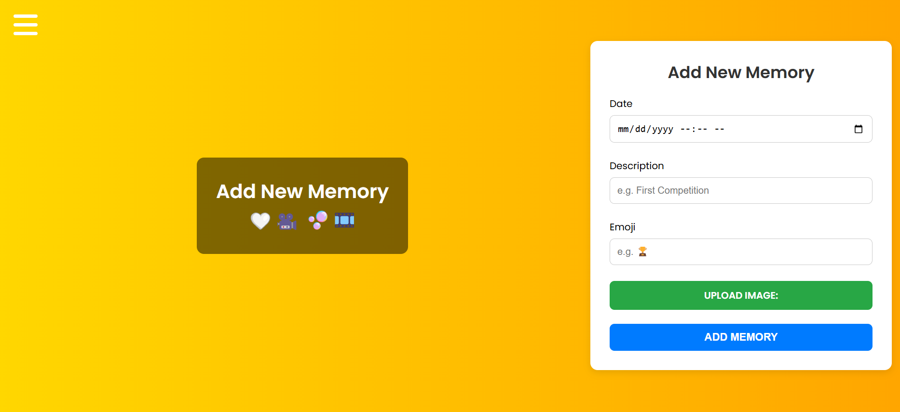

# ✨ Stars Memory App ✨

A React-based web application for storing and displaying memories with images, countdowns, and beautiful animations.

A live demo can be accessed from 🌍 [Live Demo](https://memories-df032.web.app/)

## Features

- 🖼️ Upload and display multiple images in a polaroid-style layout
- ⏰ Animated flip countdown timer for each memory
- 🎨 Automatic gradient backgrounds
- 📱 Responsive design for mobile and desktop
- 💾 Firebase integration for data storage
- 🔄 Client-side caching for better performance

## Screenshots

### Memory Pages


### Memory Submission Form



### Memory Grid


## Technologies Used

- React.js
- Firebase (Firestore & Storage)
- Material-UI
- @pqina/flip for countdown animations
- Vite for build tooling

## Setup Instructions

1. Clone the repository:
   ```bash
   git clone <repository-url>
   ```
2. Install dependencies:
   ```bash
   npm install
   ```
3. Set up environment variables:

   - Create a `.env` file in the project root
   - Add your Firebase configuration:

   ```env
   VITE_FIREBASE_API_KEY=your-api-key
   VITE_FIREBASE_AUTH_DOMAIN=your-auth-domain
   VITE_FIREBASE_PROJECT_ID=your-project-id
   VITE_FIREBASE_STORAGE_BUCKET=your-storage-bucket
   VITE_FIREBASE_MESSAGING_SENDER_ID=your-messaging-sender-id
   VITE_FIREBASE_APP_ID=your-app-id
   ```

4. Start the development server:
   ```bash
   npm run dev
   ```
5. Open your browser and navigate to `http://localhost:5173`

## Project Structure

```
src/
├── components/
│   ├── Memory/           # Memory display component
│   ├── MemoryForm/      # Form for adding new memories
│   ├── FlipCountdown/   # Countdown timer component
│   └── Polaroid/        # Image display components
├── firebase/
│   └── firebase.js      # Firebase configuration
└── App.jsx              # Main application component
```
